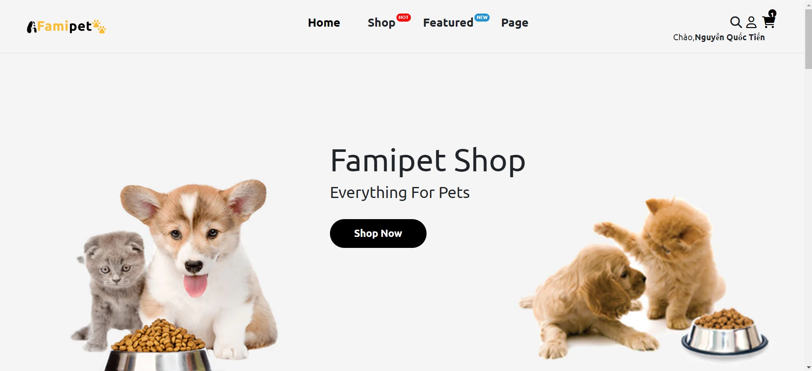
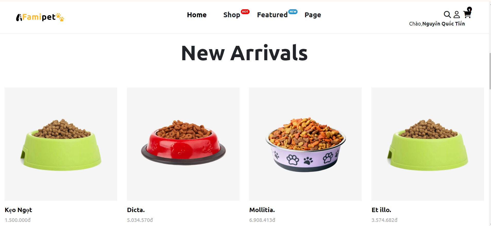
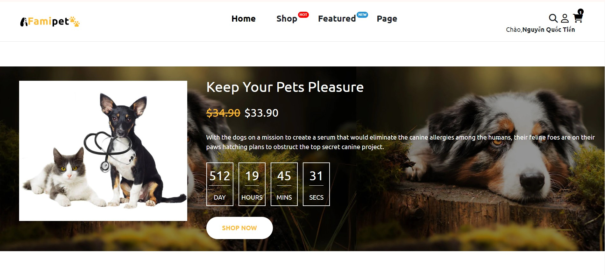
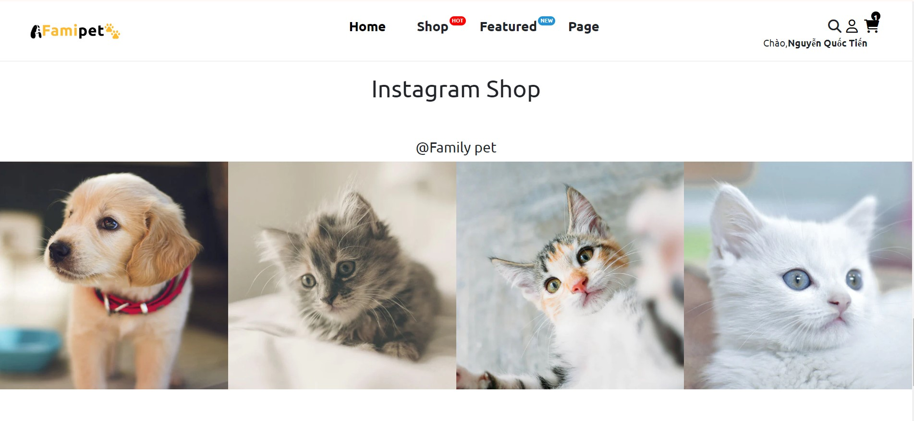
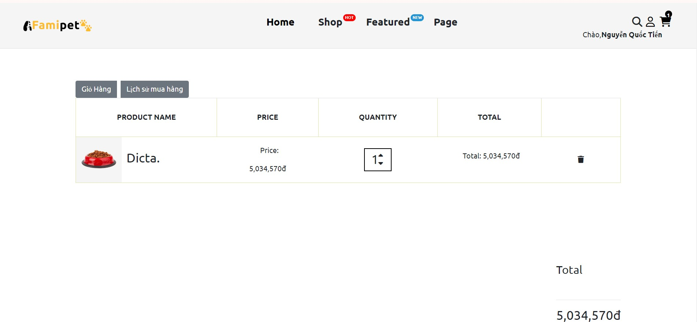
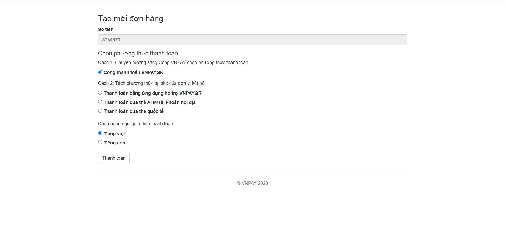
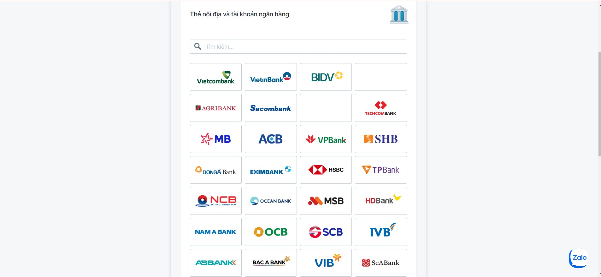
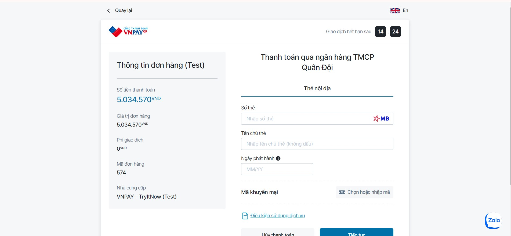

# Laravel Petshop.

A pet shop website is an e-commerce platform that allows users to browse, purchase, and adopt pets online

## About this Project:

Building a pet shop website using Laravel and MySQL provides a robust and scalable solution for managing pet inventory, handling online transactions, and delivering a seamless user experience.
Connect with me at:

    
  &nbsp;&nbsp;
  

  📫 How to reach me: <a href='mailto:nben19732@gmail.com'>nben19732@gmail.com</a>

## Technology Used:
- Laravel Framework
- Mysql
- Ajax/JQuery

## Free Features
- Login | Register
- View product
- Add to wishlist
- Search product
- Add to cart
- Online Banking (VNPAY)
 
## Screen 

